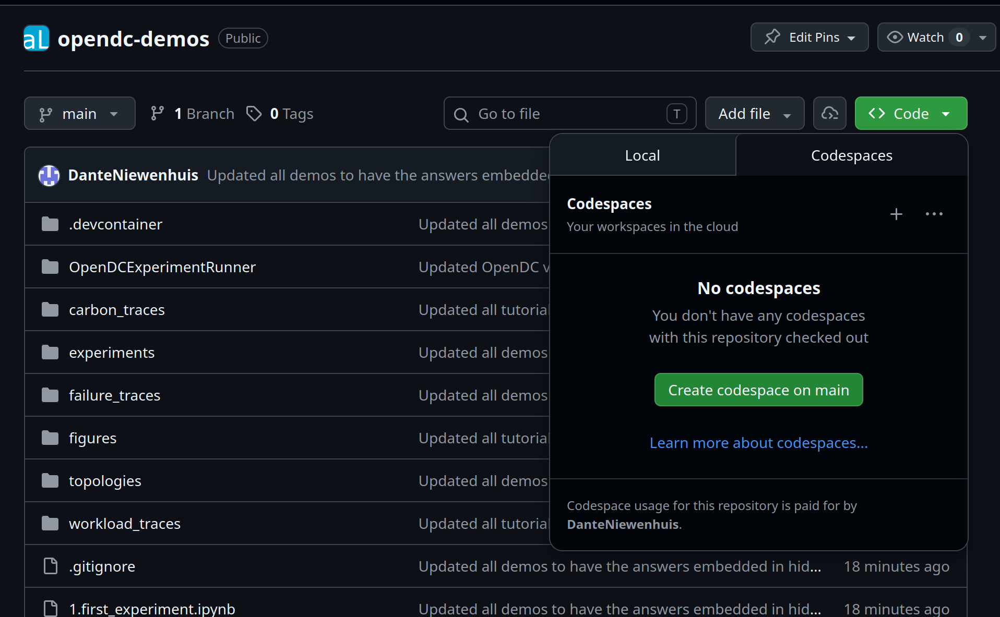
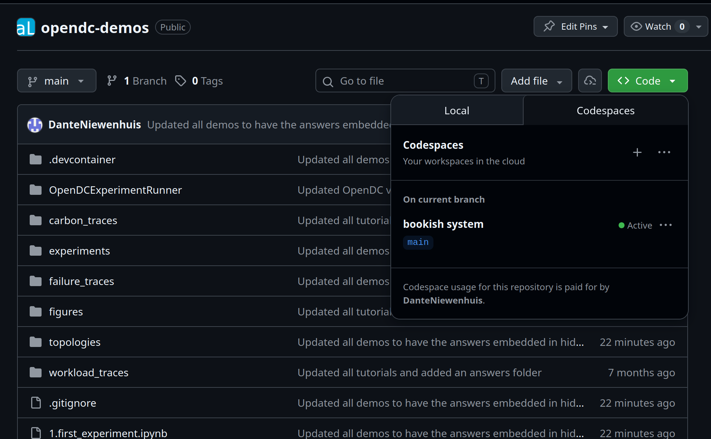
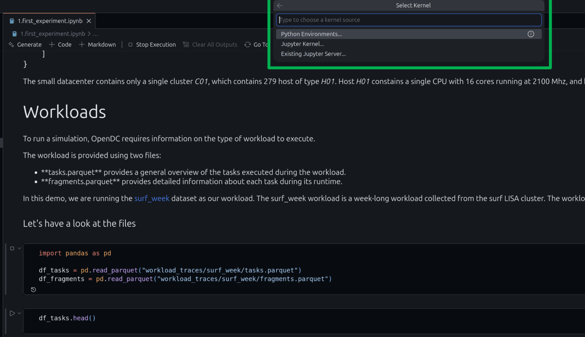
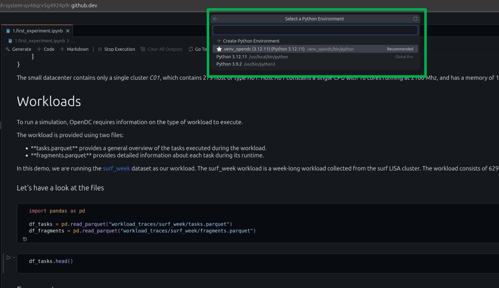

This is a repository that holds demos for the OpenDC framework. 

[OpenDCExperimentRunner](OpenDCExperimentRunner) contains the latest build of OpenDC. 
For the source code, visit https://github.com/atlarge-research/opendc

For documentation of OpenDC go [here](https://opendc.org/learn/category/documentation)

## Running the demos
The demos can be run in two ways: Through Codespaces or on a local machine. We suggest running through Codespaces because everything will be setup automatically.

### Codespaces
To run the demos through code spaces, start by visiting the [opendc-demos](https://github.com/atlarge-research/opendc-demos) github page. 

In the top right, click the green code button and select Codespaces. Here you can create a new codespace:



After creating a new codespace, it should open in a new tab, and the Codespaces overview should show an active Codespace:



**Note:** Creating the Codespace can take a few minutes because it is setting up and installing packages. 

You can now run any of the demos by opening their notebooks.

After running any of the code cells, you will be asked to select a python interpreter. 



Select the venv_opendc option. This environment already contains all the required packages to run the demo. 



You are now ready to run the demos

### Local execution

Running the demos on a local machine is straight forward. There are only two requirements that the system needs to meet: 

- Java 21
- Python 3.12 environment with the packages defined in requirements.txt installed. 

To set this up:

1. Clone this repository and open it in VS Code:
   ```
   git clone https://github.com/atlarge-research/opendc-demos.git
   cd opendc-demos
   code .
   ```
2. Make sure Java 21 is installed and available on your `PATH` (`java -version` should print 21).
3. Create a Python 3.12 virtual environment and install the required packages:
   ```
   python3.12 -m venv .venv_opendc
   source .venv_opendc/bin/activate
   pip install -r requirements.txt
   ```
4. If needed, Make the OpenDC experiment runner executable:
   ```
   chmod +x OpenDCExperimentRunner/bin/OpenDCExperimentRunner
   ```
5. Open one of the demo notebooks (e.g. `1.first_experiment.ipynb`) and, when prompted to select a Python interpreter, choose the `.venv_opendc` environment you just created.

You are now ready to run the demos.
